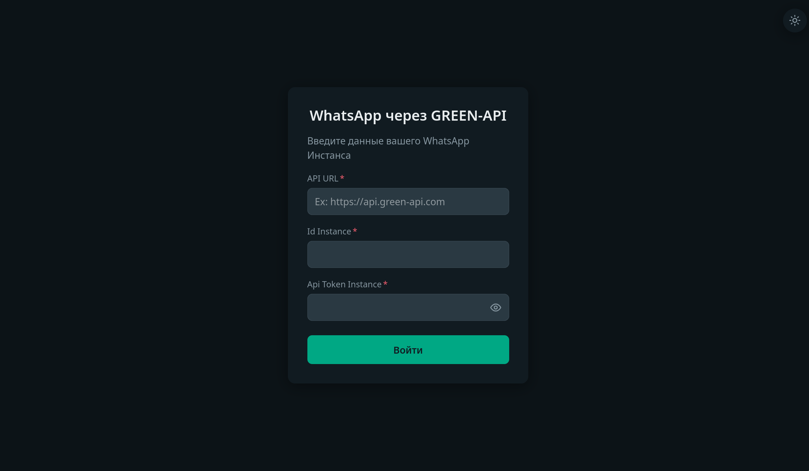
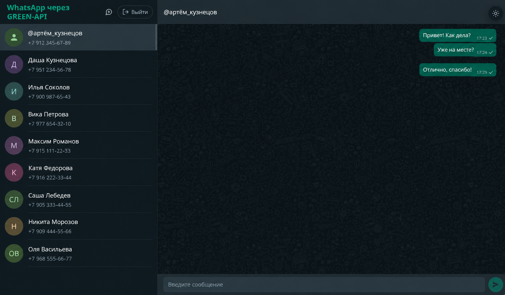

# WhatsApp через GREEN-API

Минимальный веб-клиент для отправки и получения текстовых сообщений в WhatsApp через [GREEN-API](https://green-api.com/).
За основу дизайна взята веб-версия [WhatsApp](https://web.whatsapp.com/). 🌙/☀️ Поддерживает тёмную и светлую темы.

### Это тестовое задание на позицию «Фронтенд разработчик React».

<p>
  
  
</p>

## Возможности

- Можно ввести номер телефона получателя и создать новый чат. Предварительно номер будет проверен на наличие в базах WhatsApp через метод [CheckWhatsapp](https://green-api.com/docs/api/service/CheckWhatsapp/).

- Можно отправлять только текстовые сообщения получателю в WhatsApp. Если получатель ответит на сообщение через WhatsApp, то пользователь увидит ответ. Другие виды переписки не поддерживаются, но могут легко быть добавлены. Об этом подробнее ниже в разделе «Архитектура».
Отправка сообщений реализована методом [SendMessage](https://green-api.com/v3/docs/api/sending/SendMessage/).

- Можно просматривать историю переписки со своими контактами из WhatsApp, которая реализована методом [GetChatHistory](https://green-api.com/v3/docs/api/journals/GetChatHistory/). Список контактов реализован методом [GetChats](https://green-api.com/v3/docs/api/service/GetChats/).

- Добавлена поддержка уведомления для отслеживания статуса инстанса. Если `stateInstance` будет `notAuthorized`, то пользователя немедленно разлогинит из приложения.

## Как пользоваться
1. Перейти по [ссылке]() или запустить локальную версию. Ввести данные `apiUrl`, `idInstance` и `apiTokenInstance` из личного кабинета [GREEN-API](https://console.green-api.com/) (инстанс должен быть авторизован). 
2. Ввести номер получателя в международном формате (поддерживается 8 для российских номеров) или выбрать диалог из списка слева.
3. Напишите сообщение в чате.
4. Получатель должен ответить с телефона в WhatsApp, тогда сообщение появится в диалоговом окне.

## Запуск локально

Требуется Node.js `20.19+` или `22.12+`.

1. Склонировать или скачать репозиторий.
```bash
git clone <URL репозитория>
cd test-task-green-api
```
2. Установить зависимости.
```bash
npm install
```
3. Запустить локальную версию в режиме разработчика. Перейти на http://localhost:5173 в браузере.
```bash
npm run dev
```
Для локальной сборки и просмотра собранной версии: http://localhost:4173.
```bash
npm run build
npm run preview
```

## Архитектура
**React 19** + **TypeScript**, **Vite** для сборки, **CSS Modules**, **Fetch API**

- Приложение полностью клиентское, без бэкенда. Браузер обращается к GREEN-API напрямую.

- Авторизационные данные хранятся в Session Storage, чтобы при перезагрузке страницы пользователя не разлогинивало, а при закрытии вкладки сессия закрывалась.
Чтобы обновлялся UI при записи в хранилище используется хук `useSyncExternalStore` из последних версий React.

- Для хранения состояния приложения используется только `useState`. Для списка чатов и сообщений диалога сделаны хуки обёртки `useChats` и `useChatMessages` с экспортом методов для работы с состоянием.

- Получение сообщений использует технологию [HTTP API](https://green-api.com/v3/docs/api/receiving/technology-http-api/): GREEN-API складывает входящие уведомления в очередь (в порядке поступления, хранятся 24 часа), а клиент сам забирает их методами [ReceiveNotification](https://green-api.com/v3/docs/api/receiving/technology-http-api/ReceiveNotification/) и [DeleteNotification](https://green-api.com/v3/docs/api/receiving/technology-http-api/DeleteNotification/). Для этого в настройках инстанса параметр `webhookUrl` должен быть пустым.
  > - Хук `useNotifications` запускает цикл опроса (long polling), пока пользователь авторизован: `receiveNotification` ждёт уведомление до 5 секунд. Если очередь пуста, запрос сразу повторяется.
  > - Полученное уведомление передаётся в обработчик, после чего всегда удаляется через `deleteNotification`, даже если обработчик упал или разлогинил пользователя. Иначе очередь вернула бы его снова.
  > Обработчик переводит уведомление в событие приложения (`lib/notifications.ts`), а `App` решает, что с ним делать:
   > - сообщение в открытом чате добавляется в переписку, дубли отсекаются по `idMessage`;
   > - сообщение в другом чате увеличивает счётчик «Новое сообщение +N» в списке чатов, неизвестный собеседник добавляется наверх списка, а сами сообщения подтянутся из истории при открытии чата;
  > - При ошибках опрос не прекращается, а делает паузу: от 2 секунд (от 5 при `429 Too Many Requests`) с удвоением до 60 секунд. Без сети ждёт её возвращения, при `401`/`403` останавливается. При выходе цикл сразу прерывается через `AbortController`.


- **Расширяемость.** Поддержка нового вида уведомлений (например, входящих сообщений `incomingMessageReceived` или статусов доставки `outgoingMessageStatus`) не требует менять остальной код:
  > - опрос очереди (`useNotifications`) не знает о типах уведомлений — он только получает, передаёт дальше и удаляет;
  > - формат GREEN-API изолирован в таблице обработчиков `lib/notifications.ts`: достаточно описать интерфейс в `types/Notifications.ts` и добавить одну запись, а TypeScript сам потребует обработчик для каждого типа из `NotificationBody`;
  > - обработчик возвращает событие приложения, а не формат GREEN-API, поэтому распределение по чатам, защита от дублей и счётчики непрочитанных работают для нового типа без изменений.

## Ограничения

- Только текстовые сообщения (по условию задания).
- Токен хранится в браузере и виден в запросах — для учебного клиента это нормально, в продакшене запросы стоит проксировать через свой backend.
- Очередь уведомлений у инстанса одна: если открыть приложение в двух вкладках, сообщения распределятся между ними.

## Структура папок

```
src/
├── api/          # работа с сервером и хранилищем
│   ├── greenApi.ts   # обёртка запросов, типизированные методы, тексты ошибок
│   └── session.ts    # функции для работы с session storage
├── components/   # UI-компоненты
├── hooks/        # состояние и побочные эффекты (чаты, сообщения, уведомления, тема)
├── lib/          # различные вспомогательные функции
├── types/        # типизация для основных сущностей приложения
└── index.css     # сброс стилей и палитра
```
